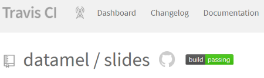
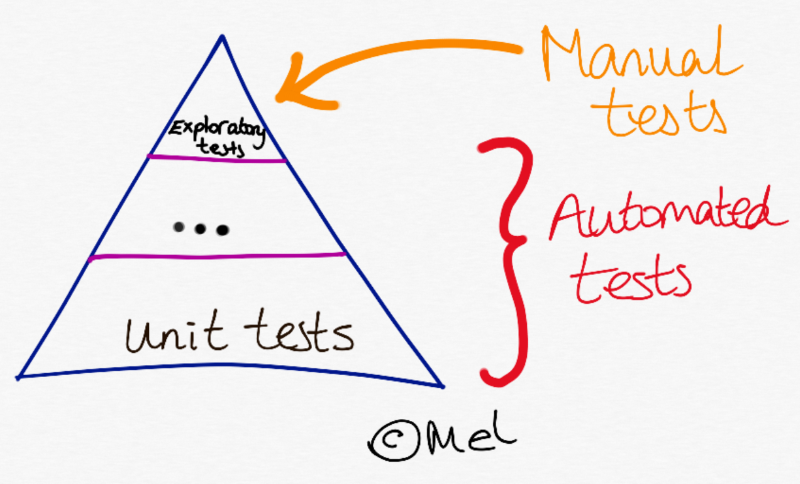
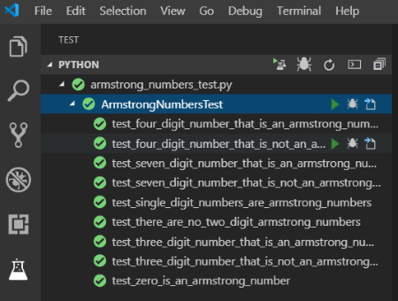

# Good Software Engineering

[](https://travis-ci.com/datamel/slides)

## Continuous Integration

> The practice of integrating changes from different developers in the team...several times a day.

Is the code in a shared **source control** repository like *git*?

Is a central server (e.g. Travis CI) checking that it still **builds**?



My CI + deployment pipeline for these slides!

[Link to stackoverflow reference for below code](https://stackoverflow.com/questions/50892018/auto-build-an-mkdocs-documentation-in-travis-ci)

```yaml
language: python # Set the build language to Python

python: 3.6 # Set the version of Python to use

branches:
  only:
  - gh-pages
  - /.*/ # Watch all branches pushed to github

# Install markdown checker
before_install:
  - sudo add-apt-repository -y ppa:mike42/mdcheckr
  - sudo apt-get update
  - sudo apt-get -y install mdcheckr

install:
    - pip install mkdocs # Install mkdocs
    - gem install mdl # Install markdown linter

script:
    - mdl docs/ ### Run markdown linter against docs/ folder
    - mdcheckr docs/*.md #### Check for broken images, link and code blocks

before_deploy:
    - mkdocs build --verbose --clean --strict ### Magic to create HTML from my markdown


deploy: # Push generated web files to GitHub
    provider: pages
    skip_cleanup: true
    github_token: $github_token
    local_dir: site
    on:
        branch: master # only publish slides from master
```

## Automated Tests

Is the application covered by a comprehensive suite of tests that run automatically?



### Advantage of automated tests

Make code changes with confidence that tests will quickly spot if I break the existing behaviour.

I've been running unit tests locally and during a CI build for my Python.



(Not typical testing) I have a CI build at travis-ci.com for these very slides that:

- checks that my markdown is valid
- checks there are no broken images
- check there are no un-closed code blocks


## Test Driven Development

Write the tests before **any** code.

Red ---> Green ---> Refactor

### 1. Failing test / red

A snapshot in time failing at `test_no_name_given`.

```python
class TwoFerTest(unittest.TestCase):

    def test_a_name_given(self):
        self.assertEqual(two_fer("Alice"), "One for Alice, one for me.")

    def test_another_name_given(self):
        self.assertEqual(two_fer("Bob"), "One for Bob, one for me.")

    def test_no_name_given(self):
        self.assertEqual(two_fer(), 'One for you, one for me.')

```

### 2. Passing / green

Added an `else` condition to satisfy new test.

```python
def two_fer(name=""):
    if name == "Alice":
        return ("One for Alice, one for me.")
    elif name == "Bob":
        return ("One for Bob, one for me.")
    else name == "":
        return('One for you, one for me.')
```

### 3. Refactored

Now that test passed (and the [Rule of Three](https://en.wikipedia.org/wiki/Rule_of_three_(computer_programming)) applied), I refactored.

```python
def two_fer(name="you"):
    return (f"One for {name}, one for me.")
```

### Advantages of TDD

- If tests are written before code then it follows that we should have less **bugs** going unnoticed.
- Most productive programming I've done was exercism.io. As they supply all the tests so never any ambiguity about **requirements** of code.
- Acts as code **documentation**.
- And if you like numbers, an easy metric for code quality from **coverage %**.
- TDD will naturally produce minimal modular code (Single Responsiblity Principle and **Y**ou **A**ren't **G**onna **T**o **N**eed **I**t)

## **Thank** **you**

### Things I didn't have time for

- SOLID  object-orientated design principles
  - Single-responsiblity principle
  - Open-closed principle
  - Liskov substitution principle
  - Interface segregation principle
  - Dependency Inversion Principle
- Loosely coupled
- High cohesion
- Design patterns e.g. singleton and repository
- Agile development, Kanban boards, SCRUM etc.
- Paired programming
